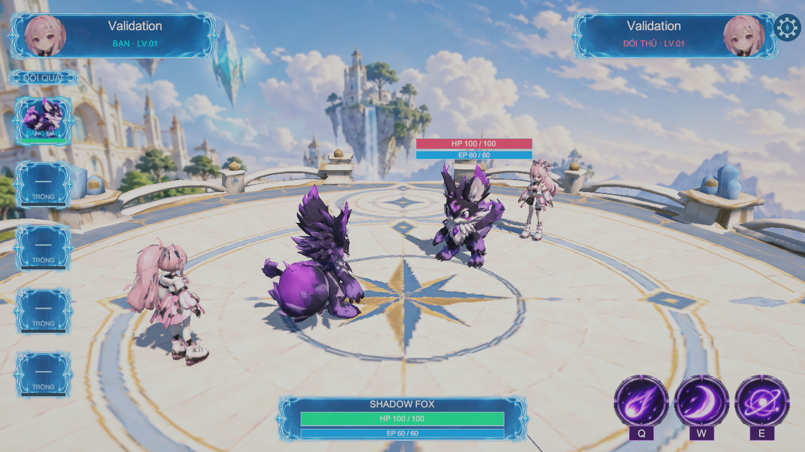
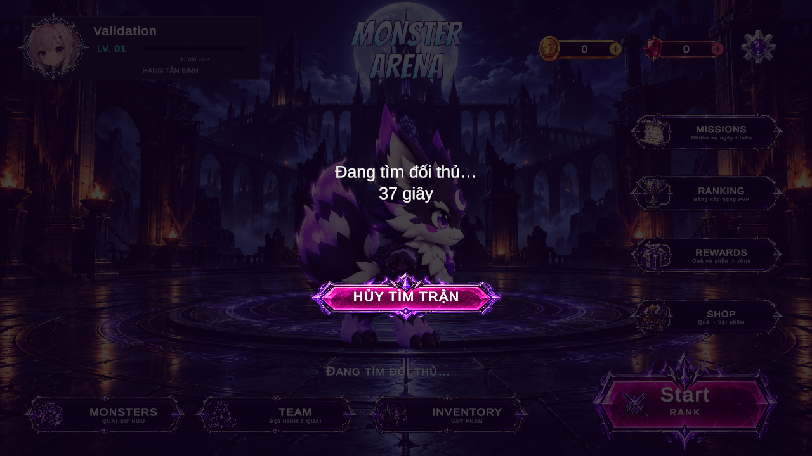
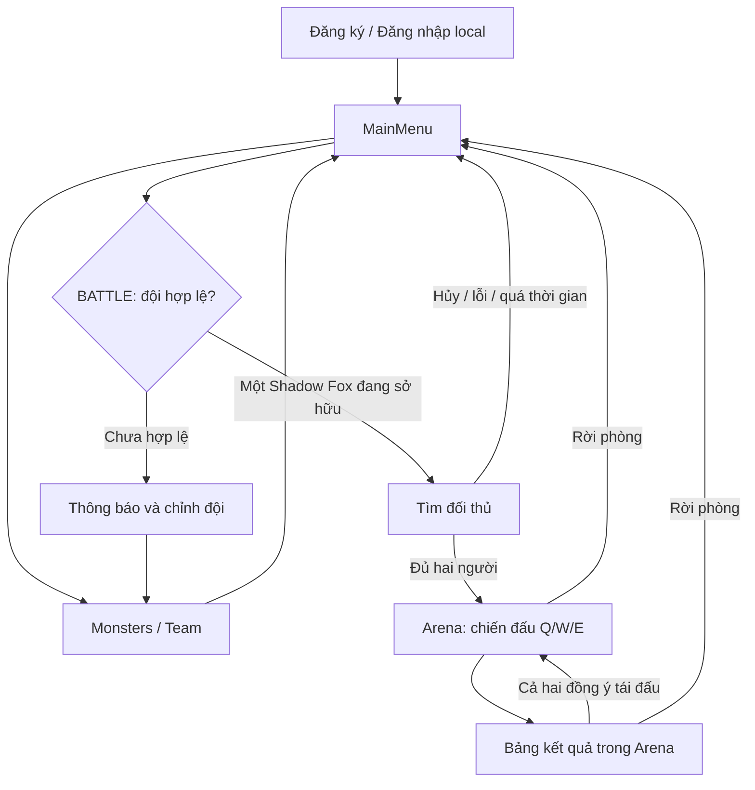
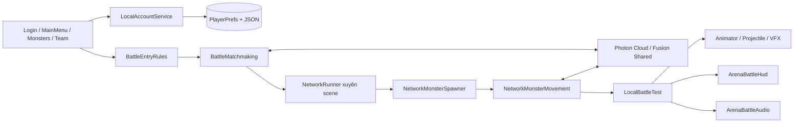

# Monster Arena

**Game đấu quái vật 3D trực tuyến 1v1, xây dựng bằng Unity và Photon Fusion.**

Monster Arena đưa hai người chơi vào một đấu trường fantasy để điều khiển quái vật, sử dụng kỹ năng và giành chiến thắng. Dự án kết hợp quản lý tài khoản cục bộ, bộ sưu tập quái, chuẩn bị đội hình, tìm đối thủ và chiến đấu đồng bộ qua mạng trong cùng một luồng trải nghiệm.

Phiên bản hiện tại tập trung vào **Shadow Fox**, với ba kỹ năng **Q / W / E**, hoạt ảnh tung chiêu–trúng đòn–bị hạ, hiệu ứng projectile, âm thanh chiến đấu, bảng kết quả và tái đấu. Trainer xuất hiện cùng quái với vai trò nhân vật đại diện, không trực tiếp tham gia gây sát thương.

> **Trạng thái: bản mẫu đang phát triển.** Đã có bản Windows và bằng chứng kiểm thử hai client. Tài khoản lưu local; trận đấu hiện hỗ trợ một Shadow Fox mỗi bên. Giao diện đội 5 ô, chữ RANK và các màn hình phụ không đồng nghĩa với đã có chiến đấu nhiều quái, xếp hạng hay nền kinh tế hoàn chỉnh.

Thông tin trong README được đối chiếu với mã nguồn, cấu hình và tài liệu dự án ngày **27/09/2026**.

## Mục lục

- [1. Giới thiệu](#gioi-thieu)
- [2. Hình ảnh và trải nghiệm gameplay](#hinh-anh)
- [3. Tính năng chính](#tinh-nang)
- [4. Luồng sử dụng và điều khiển](#luong-su-dung)
- [5. Công nghệ sử dụng](#cong-nghe)
- [6. Kiến trúc hệ thống](#kien-truc)
- [7. Cấu trúc dự án](#cau-truc)
- [8. Cài đặt, chạy và build](#cai-dat)
- [9. Kiểm thử và giới hạn](#kiem-thu)
- [10. Hướng phát triển](#huong-phat-trien)
- [11. Nguồn tài nguyên và giấy phép](#tai-nguyen)

<a id="gioi-thieu"></a>
## 1. Giới thiệu

Mục tiêu của Monster Arena là xây dựng một luồng chơi PvP hoàn chỉnh: người chơi vào tài khoản, chuẩn bị quái, tìm đối thủ, tham gia trận đấu và trở về menu để tiếp tục chơi. Phiên bản hiện tại dùng một quái mỗi bên để hoàn thiện các hệ thống nền tảng trước khi mở rộng nội dung.

Các điểm chính của trải nghiệm:

- **Đấu trực tuyến thời gian thực:** ghép hai người vào một phòng Photon Fusion Shared, đồng bộ trạng thái kỹ năng, máu và vòng đấu.
- **Chiến đấu bằng kỹ năng:** mỗi chiêu có sát thương, thời gian hồi và nhịp hoạt ảnh riêng; người chơi chọn thời điểm ra chiêu.
- **Phong cách fantasy anime:** Shadow Fox và trainer 3D trên sàn Celestial Frost, với nền trời Celestial Sanctuary.
- **Phản hồi nghe–nhìn theo sự kiện:** projectile, phản ứng trúng đòn và âm thanh bám nhịp tung chiêu/va chạm.
- **Có tài liệu kiểm chứng:** lưu log, ảnh runtime và phạm vi xác nhận để phân biệt chức năng đã chạy với hướng thiết kế chưa triển khai.

Nền tảng đã có bản build được ghi nhận là **Windows 64-bit**. Chưa có xác nhận chạy trên mobile, WebGL, macOS hoặc Linux.

<a id="hinh-anh"></a>
## 2. Hình ảnh và trải nghiệm gameplay

### Đấu trường online



Ảnh render runtime từ development build dùng kiểm thử matchmaking ngày 27/09/2026, ở độ phân giải 1280×720. Tên `Validation` thuộc tài khoản kiểm thử. Sàn và nhân vật là 3D; phong cảnh xa là panorama skybox tĩnh.

### Tìm đối thủ từ menu



Ảnh render runtime 1280×720 chụp ngày **27/09/2026** từ development build theo source mới nhất: “Đang tìm đối thủ…” và số giây nằm trên hai dòng, cùng cỡ chữ; nút **HỦY TÌM TRẬN** đã bỏ icon kiếm và không còn dòng hướng dẫn hủy. Ảnh dùng tài khoản kiểm thử `Validation`, sau khi kết nối Photon và đang chờ đối thủ. Ảnh phản ánh UI trong source hiện tại; bản release EXE cũ chưa được build lại.

<a id="tinh-nang"></a>
## 3. Tính năng chính

| Nhóm | Chức năng hiện có | Phạm vi và trạng thái |
|---|---|---|
| Tài khoản | Đăng ký, đăng nhập, đăng xuất; hồ sơ, avatar và quái sở hữu | Lưu trên máy bằng PlayerPrefs; chưa có tài khoản cloud |
| Quái khởi đầu | Cấp Shadow Fox khi vào MainMenu nếu tài khoản chưa sở hữu quái | Catalog hiện định danh một quái; mỗi ID tương ứng một mục sở hữu |
| Monsters | Xem bộ sưu tập, chọn quái hiển thị Home, thêm vào đội | Đọc dữ liệu của tài khoản đang đăng nhập |
| Team | Tối đa 5 vị trí; thêm, bỏ, đổi thứ tự và tự lưu | Chặn trùng/quái chưa sở hữu; đội trống được lưu nhưng không được vào trận |
| Matchmaking | BATTLE kiểm tra đội, tìm phòng hoặc tạo phòng, chờ đủ hai người rồi tải Arena | Chỉ nhận đội gồm đúng một Shadow Fox; hỗ trợ hủy tìm trận |
| Chiến đấu | Q/W/E, sát thương, hồi chiêu, trạng thái bị hạ và đồng bộ vòng đấu | Hai quái đứng ở vị trí đấu; chưa có đổi quái trong trận |
| Hoạt ảnh và VFX | Idle, tung ba chiêu, trúng đòn, bị hạ và projectile | Model có rig; phần trình diễn do hệ thống Arena điều khiển |
| Âm thanh | Charge, launch, impact, thắng/thua; chỉnh âm lượng | 11 clip runtime; có xử lý sự kiện đến muộn và dọn âm thanh khi rời/tái đấu |
| Kết quả | Hiển thị kết quả, yêu cầu tái đấu, rời phòng về menu | Tái đấu cần hai bên đồng ý; chưa nối ghi kết quả vào lịch sử tài khoản |
| Inventory | Popup, bộ lọc và trạng thái kho trống | Chưa có catalog vật phẩm, thu thập, sử dụng hoặc lưu vật phẩm |
| Shop | Các mục Quái / Vật phẩm / Tiền tệ | Chưa có sản phẩm, giá, giao dịch hoặc trừ tiền |
| Missions | Tab ngày/tuần, tính tiến độ từ lịch sử local theo UTC | Chưa cấp thưởng; chưa có dữ liệu mới tự ghi từ trận Arena |
| Ranking | Thông tin người chơi, số trận/thắng và tỉ lệ thắng từ lịch sử local | Chưa có bảng xếp hạng server, điểm MMR hoặc mùa giải |
| Rewards và tiền tệ | Có giao diện phần thưởng, Coin và Ruby | Chưa có cơ chế cấp thưởng hoặc nền kinh tế; số tiền hiển thị hiện là 0 |

Thanh EP hiện có giá trị tối đa **60** và được đồng bộ, nhưng mã chiến đấu chưa trừ EP khi dùng kỹ năng. Không xem đây là cơ chế tiêu hao/hồi năng lượng đã hoàn thiện.

<a id="luong-su-dung"></a>
## 4. Luồng sử dụng và điều khiển



**Cách bắt đầu:** đăng ký/đăng nhập, mở **MONSTERS** hoặc **TEAM** để bảo đảm đội có một Shadow Fox, sau đó bấm nút **BATTLE**. Artwork hiện tại của nút này hiển thị `Start / RANK`; chức năng thực tế là ghép trận 1v1 thông thường.

Trong lúc kết nối hoặc chờ đối thủ, có thể bấm **HỦY TÌM TRẬN** hoặc **Escape**. Khi đủ hai người, phòng đóng nhận người mới và chuyển sang Arena. Nếu đối thủ rời sau khi trận bắt đầu, game thông báo; người mới không được đưa vào thay thế trong trận đó.

### Điều khiển trong Arena

| Thao tác | Chức năng | Sát thương / hồi chiêu |
|---|---|---|
| **Q** hoặc nút kỹ năng thứ nhất | Chiêu thứ nhất | 12 HP / 2 giây |
| **W** hoặc nút kỹ năng thứ hai | Chiêu thứ hai | 20 HP / 5 giây |
| **E** hoặc nút kỹ năng thứ ba | Chiêu thứ ba | 32 HP / 9 giây |
| **Escape** | Mở/đóng bảng cài đặt trận | Chỉnh âm lượng, thao tác rời trận qua UI |
| **R** hoặc nút tái đấu khi có kết quả | Gửi yêu cầu tái đấu | Vòng mới chỉ bắt đầu khi hai bên đồng ý |

Mỗi quái mặc định có **100 HP**. Kỹ năng chỉ nhận khi trận sẵn sàng, quái còn sống, chiêu hết hồi và không đang trong thời gian phục hồi sau đòn. Sát thương được áp dụng theo thời điểm impact của trạng thái mạng.

**W là kỹ năng trong Arena hiện tại.** Các script di chuyển WASD còn tồn tại phục vụ prototype; không dùng chúng để suy ra điều khiển của luồng trận hiện hành. U/I/O cho phe đỏ là phím kiểm tra ở chế độ offline của `LocalBattleTest`, không phải điều khiển PvP của người chơi thứ hai.

<a id="cong-nghe"></a>
## 5. Công nghệ sử dụng

| Thành phần | Công nghệ / phiên bản trong workspace | Vai trò |
|---|---|---|
| Game engine | Unity **6000.3.11f1** | Scene, runtime, asset và build |
| Ngôn ngữ | C# | Gameplay, UI, mạng và công cụ Editor |
| Đồ họa | Universal Render Pipeline **17.3.0** | Render nhân vật, sàn, material và môi trường |
| Multiplayer | Photon Fusion **2.1.2**, DLL file version `2.1.2.2279` | Shared Mode, phòng chơi và trạng thái mạng |
| Input | Unity Input System **1.19.0** | Bàn phím và thao tác UI |
| Giao diện | Unity UI (uGUI) **2.0.0**, TextMesh Pro | Canvas, popup, HUD và văn bản |
| Dữ liệu local | PlayerPrefs + JSON | Tài khoản, đội, hồ sơ và thiết lập |
| Asset 3D | Blender, FBX, Animator | Chuẩn bị rig, animation và model cho Unity |
| Công cụ asset | Python; NumPy cho tổng hợp âm thanh | Xử lý texture, kiểm tra/export model, chuẩn bị WAV |
| Kiểm tra logic | Console harness C#, **.NET 10 SDK** | Chạy `Tests/LocalTeams` với PlayerPrefs giả trong bộ nhớ |

Phiên bản Unity lấy từ [ProjectVersion.txt](ProjectSettings/ProjectVersion.txt); package lấy từ [manifest.json](Packages/manifest.json) và [packages-lock.json](Packages/packages-lock.json). Photon được chứa trong `Assets/Photon/`.

<a id="kien-truc"></a>
## 6. Kiến trúc hệ thống



### Các thành phần đầu mối

Các tệp trong bảng nằm dưới [`Assets/MonsterArena/Scripts/`](Assets/MonsterArena/Scripts/).

| Tệp / nhóm | Trách nhiệm |
|---|---|
| `Auth/LocalAccountData.cs`, `Auth/LocalAccountService.cs` | Schema, đăng ký/đăng nhập, hồ sơ, sở hữu quái và lưu đội |
| `Auth/LoginUIController.cs` | Form tài khoản và chuyển tới MainMenu |
| `Auth/MainMenuUIController.cs` | Điều phối menu, cấp quái khởi đầu khi cần, mở các popup và gọi BATTLE |
| `Auth/MonsterCatalog.cs`, `Auth/MonsterTeamUIController.cs` | Định danh Shadow Fox và thao tác bộ sưu tập/đội |
| `BattleEntryRules.cs` | Kiểm tra tài khoản, quyền sở hữu và đội được phép vào Arena |
| `BattleMatchmaking.cs` | Vòng đời kết nối, ghép cặp, tải scene, timeout và dọn phiên |
| `MatchmakingPanel.cs` | Lớp phủ tìm trận, thời gian chờ và nút hủy |
| `NetworkMonsterSpawner.cs` | Gắn vào runner, tạo quái mạng cho người chơi |
| `NetworkMonsterMovement.cs` | Trạng thái mạng của quái, HP, kỹ năng, timer, vòng đấu và tái đấu |
| `LocalBattleTest.cs` | Trình diễn Arena ở chế độ online/offline, animation, projectile và nhịp impact |
| `ArenaBattleHud.cs` | HP/EP, nút kỹ năng, hồi chiêu, cài đặt và bảng kết quả |
| `ArenaBattleAudio.cs` | Nạp WAV, phát theo sự kiện và dừng/reset nguồn âm |
| `MatchmakingValidationClient.cs` | Harness kiểm tra bằng development player; loại khỏi release |

`LocalBattleTest` là thành phần đang dùng để trình diễn Arena, dù tên tệp có chữ “Test”. Những script prototype khác vẫn được giữ trong dự án; bảng trên chỉ ra các đầu mối của luồng hiện hành.

### Dữ liệu và kết nối

- **Tài khoản local:** cơ sở dữ liệu JSON lưu dưới khóa `MonsterArena.LocalAccounts.v1`; tài khoản đang chọn dùng khóa `MonsterArena.CurrentAccountId.v1`. Mật khẩu được băm bằng PBKDF2-SHA256 với salt riêng. Dữ liệu này không có dịch vụ đồng bộ tài khoản giữa máy và không phải hệ thống xác thực server.
- **Trạng thái trận:** Fusion đồng bộ thông tin người chơi, phe, HP/EP, kỹ năng, số thứ tự đòn đánh, timer và vòng đấu. Client có State Authority áp dụng logic trạng thái tương ứng; hiện chưa có dedicated server chống gian lận.
- **Ghép cặp:** Shared Mode, tối đa hai người, custom lobby `MonsterArena-ShadowFox-v1`, thuộc tính phòng `battle=shadowfox-v1`. Khi đủ người, master đóng/ẩn phòng và tải Arena; runner được giữ xuyên scene.
- **Thời gian chờ:** giới hạn kết nối 30 giây, tìm đối thủ 120 giây, tải/đợi sẵn sàng 45 giây. Lỗi hoặc hủy sẽ dọn phiên và trả thông báo về menu.
- **Lịch sử:** đã có schema và hàm `AddMatchHistory`, nhưng chưa có lời gọi ghi kết quả từ luồng Arena hiện hành. Missions và Ranking đọc lịch sử local, chưa tạo thành vòng tiến trình sau trận hoàn chỉnh.

<a id="cau-truc"></a>
## 7. Cấu trúc dự án

```text
Monster Arena/
├── Assets/
│   ├── MonsterArena/                 # Nội dung và mã chính của game
│   │   ├── Art/
│   │   │   ├── CelestialFrostArena/   # FBX, texture, material và prefab sàn
│   │   │   ├── Environment/          # Panorama, material và shader môi trường
│   │   │   ├── Monsters/             # Hình quái dùng trong giao diện
│   │   │   ├── References/           # Tài nguyên tham khảo
│   │   │   └── UI/                   # Nền, icon, frame và design system
│   │   ├── Editor/                   # Tạo UI, chuẩn bị asset, validation, build
│   │   ├── Materials/                # Material của game
│   │   ├── Models/
│   │   │   ├── BattleReady/          # Shadow Fox/trainer đã chuẩn bị cho trận
│   │   │   └── Monsters/             # Model quái và tài nguyên liên quan
│   │   ├── Prefabs/                  # Quái mạng hai phe và projectile
│   │   ├── Resources/
│   │   │   └── BattleAudio/ShadowFox/ # 11 WAV dùng khi chạy game
│   │   ├── Scenes/
│   │   │   ├── Auth/Login.unity      # Điểm bắt đầu của bản matchmaking
│   │   │   ├── MainMenu.unity        # Menu và các popup
│   │   │   ├── Arena.unity           # Trận đấu chính
│   │   │   ├── BattleTest.unity      # Scene thử nghiệm trận
│   │   │   └── ModelPreview.unity    # Xem model
│   │   └── Scripts/
│   │       ├── Auth/                 # Tài khoản, menu, catalog, đội hình
│   │       └── *.cs                  # Matchmaking, mạng, gameplay, HUD, audio
│   ├── Photon/                       # Fusion SDK, Realtime và cấu hình
│   ├── Resources/                    # BattleHUD và tài nguyên MonsterArena
│   ├── Settings/                     # Tài nguyên cấu hình render
│   ├── TextMesh Pro/                 # Font và tài nguyên TMP
│   ├── Scenes/                       # Scene mẫu của project
│   ├── TutorialInfo/                 # Nội dung hướng dẫn của template
│   └── _Recovery/                    # Dữ liệu khôi phục hiện có trong workspace
├── Packages/                         # Manifest và package lock
├── ProjectSettings/                  # Unity version, build scenes, cấu hình
├── Docs/
│   ├── Audio/                        # Nguồn mẫu âm thanh và script tái tạo
│   ├── Concept/                      # Concept, prompt và quyết định mỹ thuật
│   ├── Previews/                     # Ảnh xem trước trong quá trình phát triển
│   └── Validation/                   # Log và ảnh runtime dùng đối chiếu
├── Tools/                            # Python hỗ trợ model, texture và audio
├── Tests/LocalTeams/                  # Harness kiểm tra tài khoản/đội/BATTLE
├── Builds/                           # Các bản Windows xuất trên máy
├── MonsterArenaValidation/           # Workspace Unity phụ phục vụ validation
└── README.md                         # Giới thiệu và hướng dẫn tổng quan
```

Cây trên mô tả các nhánh phục vụ phát triển và chạy game; không liệt kê từng asset hoặc file `.meta`. Giữ các file `.meta` đi kèm khi chuyển source để bảo toàn GUID và tham chiếu Unity.

`Library/`, `Temp/`, `Logs/`, `obj/`, `bin/`, tệp `.csproj` và `.slnx` thuộc dữ liệu cache/build hoặc công cụ sinh ra; `UserSettings/` và `.vscode/` chứa thiết lập môi trường cá nhân. Các thư mục làm việc như `.monster_arena_unity_validation/`, `.docx_review_20260915/` và `UIElementsSchema/` không phải luồng runtime của game. `Builds/` và workspace validation là đầu ra/phụ trợ cục bộ, không được bảo đảm có trong mọi bản sao source.

### Scene và công cụ Editor

Thứ tự scene đang bật trong [EditorBuildSettings.asset](ProjectSettings/EditorBuildSettings.asset): **Login → MainMenu → Arena**. Kết quả trận được hiển thị bằng HUD trong Arena; không cần một scene Result riêng cho luồng này.

| Công cụ trong `Assets/MonsterArena/Editor/` | Mục đích |
|---|---|
| `BuildLoginUI.cs`, `BuildMainMenuUI.cs`, `BuildGameHubUI.cs` | Dựng/cập nhật UI tài khoản và menu |
| `PrepareBattleModels.cs`, `CreateTeamNetworkMonsterPrefabs.cs` | Chuẩn bị model và prefab hai phe |
| `InstallCelestialFrostArena.cs`, `ApplyArenaEnvironment.cs` | Cài sàn và áp dụng môi trường |
| `ValidateBattleHud.cs`, `ValidateBattleAudio.cs` | Kiểm tra HUD và âm thanh |
| `ValidateMatchmaking.cs` | Build client matchmaking release/development |
| `ValidateArenaSizing.cs`, `BuildMonsterArenaWindows.cs` | Công cụ cho các bản đấu trường trước |

Một số lệnh Editor **chỉnh scene hoặc ghi lại asset**. Đọc mã và lưu các thay đổi cần giữ trước khi chạy. Không chạy công cụ dựng UI/sàn chỉ để xem dự án: ví dụ `InstallCelestialFrostArena` dùng prefab gốc rộng 22 đơn vị, trong khi cấu hình sàn đã chốt trong Arena rộng 30 đơn vị.

<a id="cai-dat"></a>
## 8. Cài đặt, chạy và build

### Yêu cầu

- Unity Hub và **Unity 6000.3.11f1**; cài module Windows Build Support phù hợp nếu xuất Windows player.
- Bản source đầy đủ gồm `Assets/`, `Packages/`, `ProjectSettings/` và các file `.meta`.
- Kết nối Internet và cấu hình ứng dụng Photon Fusion hợp lệ để chơi online.
- **.NET 10 SDK** nếu chạy harness `Tests/LocalTeams`; không cần cài riêng SDK này chỉ để mở bản EXE.
- Python và dependency của từng script chỉ cần khi tái tạo/xử lý asset; không cần cho người chạy game.

### Mở trong Unity

1. Trong Unity Hub, chọn **Add project from disk** và chọn thư mục gốc chứa `Assets`, `Packages`, `ProjectSettings`.
2. Mở bằng phiên bản Unity nêu trên; chờ import và resolve package hoàn tất, kiểm tra Console trước khi Play.
3. Chọn [`PhotonAppSettings.asset`](Assets/Photon/Fusion/Resources/PhotonAppSettings.asset) trong Project, cấu hình **App Id Fusion** cho ứng dụng Photon mà bạn sử dụng. Không dùng App ID của một loại dịch vụ Photon khác.
4. Kiểm tra hai client dùng cùng App ID, App Version, region và phiên bản game tương thích. Cấu hình workspace hiện đặt **Fixed Region = `asia`**. Cấu hình mạng của Fusion nằm tại [`NetworkProjectConfig.fusion`](Assets/Photon/Fusion/Resources/NetworkProjectConfig.fusion).
5. Mở [`Login.unity`](Assets/MonsterArena/Scenes/Auth/Login.unity), bấm **Play**, đăng ký hoặc đăng nhập tài khoản local.
6. Vào **MONSTERS / TEAM**, bảo đảm đội gồm đúng một Shadow Fox rồi bấm **BATTLE**.

Mở trực tiếp `Arena.unity` sẽ dùng đường thử riêng với phòng `MonsterArena-1v1`; đường này không kiểm tra đầy đủ luồng vào trận từ menu. Để thử matchmaking, bắt đầu từ Login/MainMenu ở cả hai client.

### Chạy bản Windows

Nếu workspace có bản build, mở:

```text
Builds/MonsterArena-Matchmaking/MonsterArena.exe
```

Giữ nguyên **toàn bộ thư mục build**, gồm `MonsterArena_Data` và các DLL đi kèm. Tài khoản/đội lưu theo môi trường local; không giả định dữ liệu Editor tự xuất hiện trong player hoặc trên máy khác.

| Bản build cục bộ | Mục đích |
|---|---|
| `Builds/MonsterArena-Matchmaking/` | Luồng Login → MainMenu → BATTLE → Arena |
| `Builds/MonsterArena-Matchmaking-Test/` | Development build có harness kiểm tra |
| `Builds/MonsterArena-Audio/` | Bản chiến đấu/âm thanh đã được xác nhận ở mốc 20/09 |
| `Builds/MonsterArena-Arena30/` | Bản sàn 30 đơn vị trước tích hợp âm thanh |

**Chênh lệch source và EXE:** log build matchmaking hiện ghi thành công ngày 27/09/2026 lúc `11:00:24 UTC`, 0 lỗi và 1 cảnh báo font. Các chỉnh sửa source sau đó về vị trí icon BATTLE, thông báo menu mặc định và bảng tìm trận chưa được build lại. Muốn có các chỉnh sửa này trong EXE, cần xuất bản mới từ source.

### Kiểm tra hai client

1. Chạy hai Windows player độc lập, hoặc một Editor và một Windows player tương thích.
2. Đăng nhập và chuẩn bị đội một Shadow Fox ở mỗi client.
3. Bấm BATTLE ở cả hai; kiểm tra cả hai vào cùng trận, ở hai phe khác nhau.
4. Dùng Q/W/E, quan sát HP và hồi chiêu, sau đó kiểm tra kết quả, tái đấu và rời trận theo phạm vi cần xác minh.

Các ca tự động hiện có dùng nhiều tiến trình trên **cùng một máy**. Chưa có bằng chứng kiểm thử matchmaking trên hai máy vật lý/hai mạng khác nhau.

### Xuất bản Windows mới

Thoát Play Mode, lưu scene cần giữ, rồi chọn menu Unity:

```text
Monster Arena > Matchmaking > Build Windows Client
```

Lệnh `ValidateMatchmaking.BuildRelease` xuất Windows 64-bit vào `Builds/MonsterArena-Matchmaking/MonsterArena.exe`, với thứ tự Login → MainMenu → Arena. Lệnh ghi vào thư mục build đó; sao lưu bản cần giữ trước khi chạy. Kết quả được ghi tại [`Docs/Validation/Matchmaking/Build.txt`](Docs/Validation/Matchmaking/Build.txt).

### Các tình huống thường gặp

| Hiện tượng | Kiểm tra |
|---|---|
| BATTLE báo đội chưa hợp lệ | Đội phải có đúng một Shadow Fox đang sở hữu; không để trống hoặc thêm ID chưa có gameplay |
| Hai client không gặp nhau | Kiểm tra App ID, App Version, region, bản game và việc cả hai bắt đầu từ menu |
| Một bên mở thẳng Arena | Đang dùng phòng thử khác với custom lobby của matchmaking; khởi động lại từ Login |
| EXE không có UI mới nhất | Đối chiếu log build và trạng thái source; xuất lại bằng lệnh matchmaking |
| Cảnh báo TMP thiếu ký tự | Đọc log font; bản build đã ghi nhận thiếu ký tự ellipsis trong LiberationSans SDF |

<a id="kiem-thu"></a>
## 9. Kiểm thử và giới hạn

### Bằng chứng hiện có

Các kết quả dưới đây có phạm vi và thời điểm riêng; không phải tuyên bố toàn bộ source mới nhất đã qua lại mọi bài kiểm tra.

| Phạm vi | Kết quả được ghi nhận | Bằng chứng |
|---|---|---|
| Logic tài khoản, đội và điều kiện BATTLE | 22/22 kiểm tra đạt với PlayerPrefs giả trong bộ nhớ | Kết quả harness tại thời điểm kiểm tra |
| Matchmaking development build | Hai cặp tiến trình vào phòng riêng; đúng hai người/một runner mỗi client; Q gây sát thương đồng bộ; rời và tìm lại đạt | Kiểm tra runtime trên cùng máy |
| Hủy và mất kết nối | Hủy trong startup/đang chờ, chống bấm lặp, dọn runner; mô phỏng mất kết nối bằng API | Kiểm tra runtime và log cục bộ |
| Build matchmaking release | Succeeded, 0 lỗi, 1 cảnh báo font TMP | Log build cục bộ |
| Audio trong Play Mode offline | 46 kiểm tra PASS; Unity giải mã 11 clip; kiểm tra nhịp âm, kết quả, volume và cleanup | Bộ kiểm tra Play Mode |
| Trận online ở mốc audio 20/09 | Người dùng xác nhận Q/W/E, hai hướng thắng–thua, tái đấu và rời phòng trên hai client | Xác nhận nghiệm thu của người dùng |
| Giao diện menu | Có các ca Play Mode riêng cho Monsters/Team, Inventory, Shop và Ranking | Kiểm tra trực tiếp trong Unity |

### Chạy kiểm tra logic

Từ thư mục gốc, với .NET 10 SDK:

```powershell
dotnet run --project Tests/LocalTeams/LocalTeams.csproj
```

Harness dùng các lớp tài khoản/đội/điều kiện vào trận của dự án cùng mô phỏng PlayerPrefs và JSON trong bộ nhớ. Lệnh này không đọc/sửa tài khoản Unity thật, nhưng cũng không thay thế kiểm thử Unity UI, Photon hoặc gameplay.

### Giới hạn cần biết

- **Nội dung trận:** chỉ một loại quái và một quái mỗi bên; chưa có chuyển quái, nâng cấp hoặc chiến đấu đội nhiều quái.
- **Dữ liệu:** tài khoản local, chưa đồng bộ cloud; lịch sử chưa nhận kết quả tự động từ Arena; chưa có kinh tế hoặc phần thưởng hoạt động đầy đủ.
- **Mạng:** chưa có reconnect, ghép theo trình độ hoặc dedicated server chống gian lận. Chưa kiểm tra mạng trễ cao/rớt gói hoặc hai mạng vật lý khác nhau.
- **Kiểm thử phiên mới:** ca online matchmaking chạy trên development build; release đã build/kiểm tra khởi động nhưng chưa lặp toàn bộ ca online. Chưa có xác nhận trải nghiệm luồng BATTLE mới từ người dùng.
- **Timeout và UI:** các nhánh hết 120 giây tìm trận, lỗi tải 45 giây mới được kiểm tra mã; chưa kiểm chứng đầy đủ các tỉ lệ màn hình ngoài 16:9. Một số popup mới có kiểm tra biên dịch hoặc kiểm tra trực quan hạn chế.
- **Môi trường:** nền Celestial Sanctuary là panorama tĩnh, chưa có parallax, va chạm hay animation mây/thác nước.
- **Âm thanh và hiệu năng:** kiểm tra WAV, AudioSource và sự kiện không tương đương phép đo âm học; chưa công bố benchmark FPS hoặc cấu hình máy tối thiểu.

<a id="huong-phat-trien"></a>
## 10. Hướng phát triển

Thiết kế ban đầu đặt ra hướng đội tối đa 5 quái, một quái hoạt động tại một thời điểm, đổi quái và kỹ năng có tiêu hao năng lượng. Đây là **định hướng thiết kế**, chưa phải tính năng hoàn thành của Arena hiện tại; bộ phím và luật mở rộng cần được chốt lại trước khi triển khai.

Các khoảng trống hiện có gồm kết nối kết quả trận với dữ liệu tiến trình, tài khoản online, xếp hạng, kinh tế/vật phẩm và độ bền khi mất kết nối. README ghi nhận phạm vi này để người đọc hiểu mức hoàn thiện; chưa có lịch phát hành hoặc cam kết thực hiện cho các mục mở rộng.

<a id="tai-nguyen"></a>
## 11. Nguồn tài nguyên và giấy phép

| Tài nguyên | Nguồn và xử lý được ghi nhận |
|---|---|
| Shadow Fox và trainer | Model được cung cấp cho dự án, chuẩn bị rig/animation qua Blender và FBX; bản dùng trong trận nằm ở `Assets/MonsterArena/Models/BattleReady/` |
| Celestial Frost Arena | Sàn nhập từ bộ FBX được cung cấp; asset Unity ở `Assets/MonsterArena/Art/CelestialFrostArena/` |
| Panorama Celestial Sanctuary | Ảnh tạo bằng ImageGen, prompt và cách áp dụng lưu trong tài liệu concept |
| UI và icon | Asset/design system trong `Assets/MonsterArena/Art/UI/`; nhiều icon và HUD tiền tệ có prompt ImageGen trong tài liệu UI |
| Âm thanh Shadow Fox | Tổng hợp bằng Python/NumPy, seed `2092026`; nguồn mẫu không dùng bản thu hoặc thư viện âm thanh bên ngoài |
| Photon và dependency | SDK bên thứ ba trong `Assets/Photon/`; các package Unity được khai báo trong `Packages/` |

Các script hỗ trợ nằm trong [`Tools/`](Tools/): `audit_battle_models.py`, `export_battle_fox.py`, `prepare_battle_textures.py`, `prepare_battle_audio.py`. Script sinh mẫu âm thanh là [`generate_samples.py`](Docs/Audio/ShadowFox-v1/generate_samples.py); chạy lại có thể ghi đè bộ mẫu trong thư mục nguồn.

**Giấy phép:** workspace chưa có tệp LICENSE tổng thể ở thư mục gốc. Nguồn cung cấp model/asset chưa đủ thông tin để kết luận quyền phân phối lại; các SDK/package giữ điều kiện sử dụng riêng. README này không cấp thêm quyền sử dụng hoặc phân phối mã và tài nguyên.

---
Phát triển bởi:
Họ và tên: **Bế Thị Xuyến** 
Email: [kim2k5x@gmail.com](mailto:kim2k5x@gmail.com)
